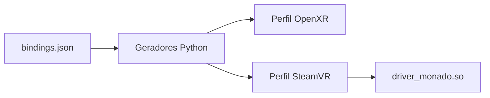

# Bindings

## Visão geral

`bindings.json` é a fonte declarativa dos perfis de interação OpenXR e SteamVR
usados pelo Monado.

## Responsabilidades

- Associar caminhos de entrada e saída a enums de dispositivos Monado.
- Definir componentes, nomes localizados e subaction paths.
- Fornecer dados para os geradores de bindings OpenXR e SteamVR.

## Entradas e saídas

Cada perfil declara `subpaths` com componentes como `click`, `value`,
`position`, `pose` e `haptic`. O campo `monado_bindings` aponta para os enums
definidos em `xrt_defines.h`.

## Fluxo principal

## Tratamento de erros e casos-limite

- Um enum sem perfil gerado impede a ativação do dispositivo no bridge SteamVR.
- Entradas de pose são usadas pelo bridge para atualizar o `DriverPose_t`.
- Perfis com entradas específicas por mão devem declarar `side` para evitar
  expor controles da mão oposta.

## Exemplos

O perfil `mndx/pssense` representa os controles dos PlayStation VR2 Sense:
botões, gatilho, squeeze, thumbstick, poses e haptics.

## Dependências e integrações

- `src/xrt/auxiliary/bindings/bindings.py`
- `src/xrt/state_trackers/steamvr_drv/steamvr_bindings/ovrd_bindings.py`
- `src/xrt/include/xrt/xrt_defines.h`
