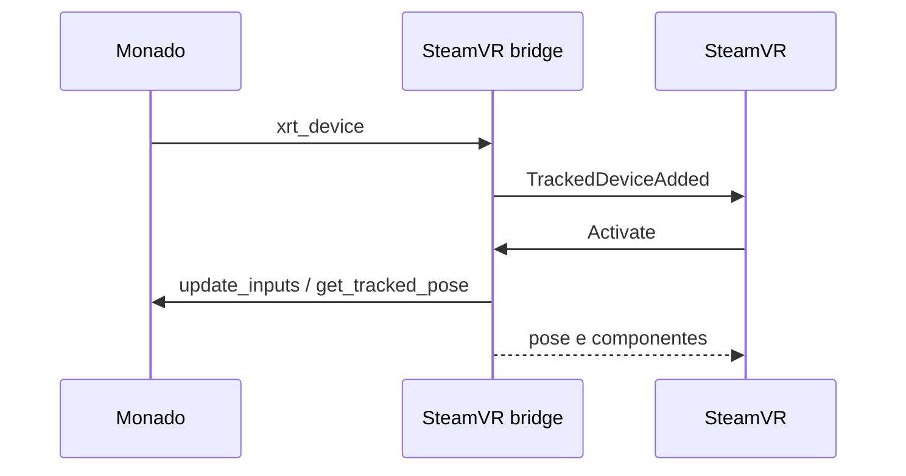

# SteamVR Monado Driver

## Visão geral

`ovrd_driver.cpp` implementa o bridge que publica dispositivos Monado como
dispositivos rastreados no SteamVR.

## Responsabilidades

- Registrar HMDs e controladores no SteamVR.
- Ativar perfis de entrada e saída gerados pelo Monado.
- Atualizar poses e estados de entrada.
- Encaminhar haptics para o dispositivo Monado.

## Entradas e saídas

O bridge recebe `xrt_device` e seus enums de entrada/saída. Ele publica
controladores com papéis esquerdo ou direito e registra componentes SteamVR
correspondentes.

## Fluxo principal

## Tratamento de erros e casos-limite

- Dispositivos sem perfil gerado não podem ser ativados.
- O PSVR2 Sense usa `XRT_INPUT_PSSENSE_GRIP_POSE` para atualizar a pose.
- Entradas ausentes no dispositivo são registradas e ignoradas durante a
  atualização do frame.

## Exemplos

O perfil `XRT_DEVICE_PSSENSE` é carregado pelo arquivo SteamVR gerado a partir
de `src/xrt/auxiliary/bindings/bindings.json`.

## Dependências e integrações

- OpenVR driver API.
- `b_ovrd_generated_bindings.h`.
- `xrt_device` e enums em `xrt_defines.h`.
